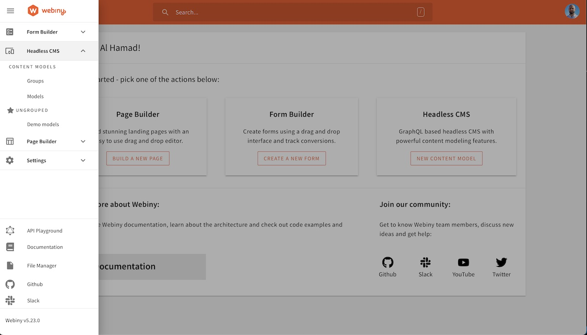

import { Alert } from '@/components/Alert'

<Alert type="success" title="WHAT YOU'LL LEARN">

- Webiny Admin app overview

</Alert>

Webiny CMS is a unified product that consists of several apps. To access them, you use the Admin app. The Admin app not only contains ready-made apps, but also provides a framework for developers to extend their functionality, and develop custom ones.

The Admin app consists of numerous plugins you use to do different things, like changing the logo, adding or removing items from the main menu, adding new functionality to the existing UI. 
Admin app also features a scaffold template to quickly create a fully functional CRUD (Create, Read, Update, Delete) app. Explore the Admin app in the left menu to find out more.

