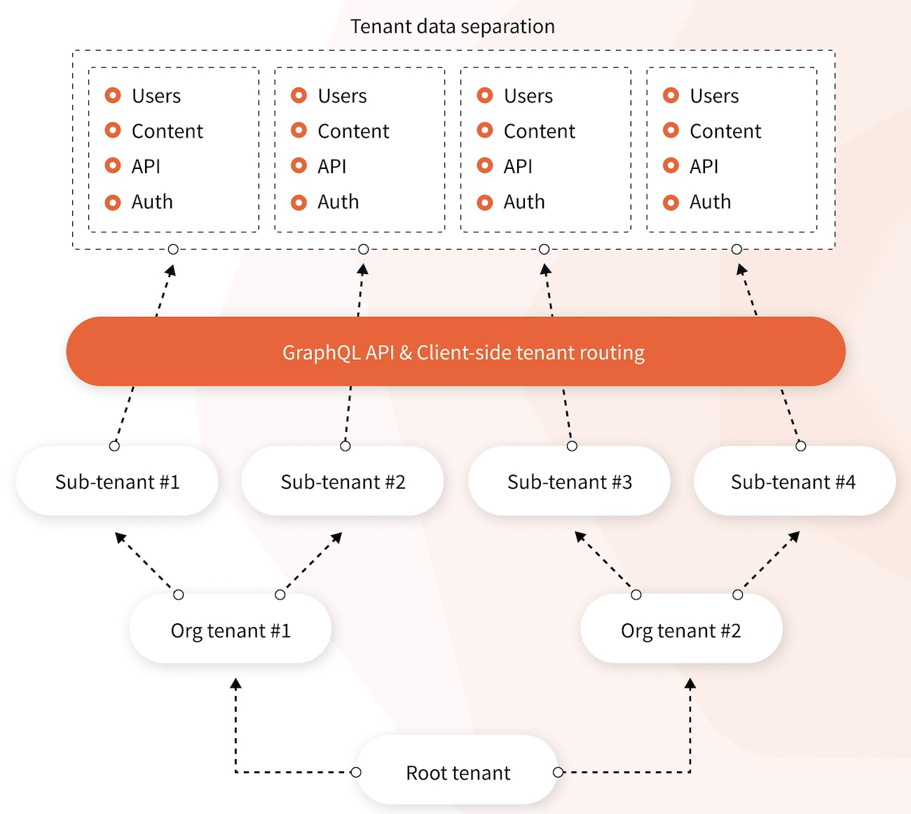

import { Alert } from '@/components/Alert'

<Alert type="success" title="WHAT YOU'LL LEARN">

- Overview of Webiny's multi-tenancy feature

</Alert>

<Alert type="warning" title="BUSINESS AND ENTERPRISE EDITION ONLY">

This feature is only available in Webiny Business and Enterprise packages. The feature is not available in the Open Source edition. 

</Alert>

Why have dozens of CMS installations to manage when you can have only one? 

This is exactly what multi-tenancy is solving.

Multi-tenancy is a core feature of Webiny CMS. It allows you to have multiple instances of Webiny CMS with complete data separation between instances, but all are running from the same code-base. It’s a powerful cost-saving feature as it means there’s only one instance to manage, regardless of whether you have 10 or 100 websites.

Multi-tenancy applies whenever you need multiple Headless CMS projects or multiple Page Builder pages.

The multi-tenancy feature comes with a flat hierarchy of tenants out of the box. However, in the Webiny Enterprise edition, this hierarchy can be modified to have several levels of depth and inheritance between the tenants. 

